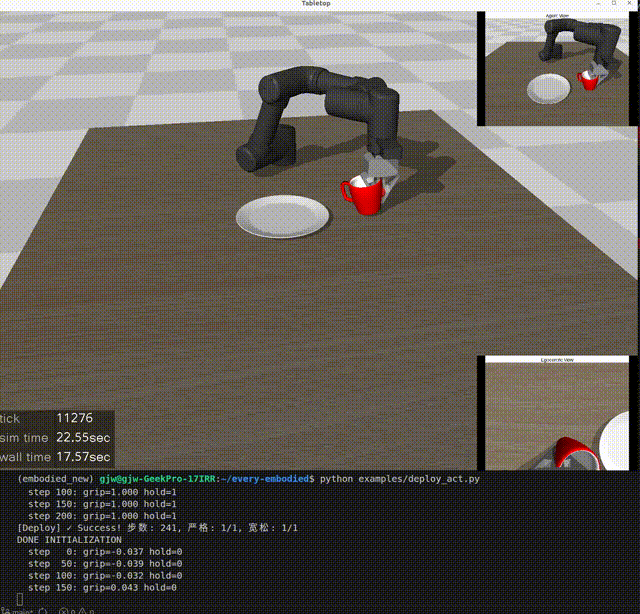

# ACT Pick-and-Place (MuJoCo)

在 MuJoCo 仿真中复现 Action Chunking Transformer (ACT)，完成"抓杯子→放盘子"任务。

- 数据集: 99 episodes, 20Hz
- 模型: ACT + CVAE, chunk_size=50, dim_model=512
- 训练步数: 6000 steps
- MAE: 0.031 (gripper: 0.031)
- 成功率: ~90%

## Rollout 演示



---

## 可复现步骤

### 1. 克隆教程仓库

```bash
git clone https://github.com/datawhalechina/every-embodied.git
cd every-embodied
ls "06-策略抓取或抓取VLA/大模型控制、VLA、VLM/04mujoco复现ACT、Pi0、SmolVLA/mujoco_env/"
ls "06-策略抓取或抓取VLA/大模型控制、VLA、VLM/04mujoco复现ACT、Pi0、SmolVLA/asset/"
```

### 2. 安装依赖

```bash
conda create -n act python=3.10 -y
conda activate act
pip install mujoco torch torchvision
pip install git+https://github.com/huggingface/lerobot.git
pip install pyautogui glfw pillow pyarrow ruckig
```

### 3. 解压资源文件

```bash
cd "06-策略抓取或抓取VLA/大模型控制、VLA、VLM/04mujoco复现ACT、Pi0、SmolVLA"
unzip -o asset/objaverse/plate_11.zip -d asset/objaverse/
```

### 4. 配置数据集与权重

- **自行采集**：运行 `scripts/collect_demo.py`（P 键开始录制, O 键停止保存, Z 键重置）
- **或下载预训练权重**：放入 `ckpt/act_y_cs50/` 目录

### 5. 训练

```bash
python scripts/train_act.py
```

### 6. 部署

```bash
python scripts/deploy_act.py
```

MuJoCo 窗口弹出后，ACT 策略自动控制机械臂执行抓取任务。

---

## 文件说明

| 文件 | 作用 |
|------|------|
| `scripts/collect_demo.py` | 键盘遥操作采集示教数据 |
| `scripts/train_act.py` | 训练 ACT 模型 |
| `scripts/deploy_act.py` | 部署策略，统计成功率 |
| `scripts/model_act.py` | 模型架构各模块实现 |

---

## 关键配置

| 参数 | 值 | 说明 |
|------|-----|------|
| chunk_size | 50 | 一次预测 2.5 秒动作序列 |
| use_vae | True | VAE 提供关键正则化 |
| temporal_ensemble_coeff | 0.0 | 新旧预测等权平均 |
| gripper smoothing | 0.02/frame | 夹爪二值→连续, 过渡 2.5 秒 |

---

## 致谢

- ACT 论文: [Learning Fine-Grained Bimanual Manipulation with Low-Cost Hardware](https://arxiv.org/abs/2304.13705) (RSS 2023)
- LeRobot 框架: [huggingface/lerobot](https://github.com/huggingface/lerobot)
- 教程环境: [datawhale/every-embodied](https://github.com/datawhalechina/every-embodied)
